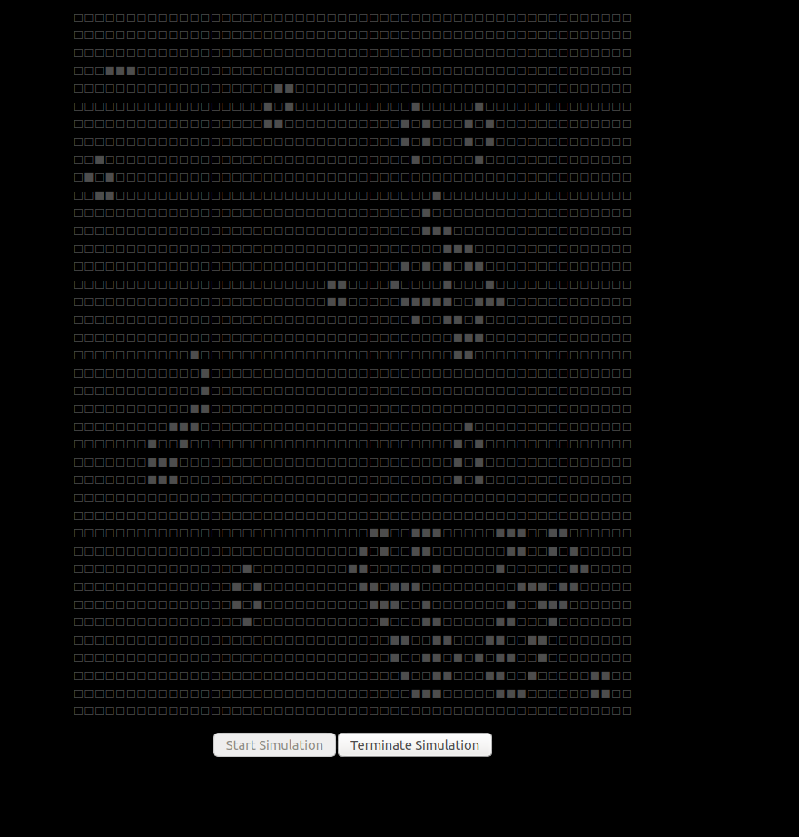

# Locutus

Demo using rust for the full stack to power a simulation. This expands on the
current Game Of Life tutorials/examples to include a server side
simulation communicating to a client wasm app that will do the 
rendering. This is mostly cobbled together from examples found
in the [yewstack/yew](https://github.com/yewstack/yew/tree/v0.17/examples) 
and [tokio-tungstenite](https://github.com/yewstack/yew/tree/v0.17/examples) 
repositories.

## Modules

* **locutus-actor:** Traits for defining an "Actor" that receives messages and updates when a `fn tick()` is called.
* **locutus-game-of-life:** The simulation logic for game of life pared down from the yew/examples/game_of_life  
* **locutus-client:** The WASM client app to create a websocket connection to a locutus-server, starting a simulation, 
   and rendering updates as state changes are pushed through the websocket.
* **locutus-server:** The websocket server for running game of life instances. The server uses a hybrid threading model 
  for efficiency. The server uses cooperative async tasks for handling connections, and a dedicated thread pool for 
  running instances of GameOfLife actors.


## Running

**Requirements**
 
* Python 3
* Rust WASM toolchain
```
# rust install
curl --proto '=https' --tlsv1.2 -sSf https://sh.rustup.rs | sh
# add the wasm target to the compiler
rustup target add wasm32-unknown-unknown
# wasm-pack install
curl https://rustwasm.github.io/wasm-pack/installer/init.sh -sSf | sh;
# wasm-bindgen-cli install
cargo install wasm-bindgen-cli

```

**Steps**

* In a terminal:

```
./run-server.sh
```

* Wait until you see a line like:

```
Aug 03 11:51:54.926  INFO serve{config=Config { ip: V4(127.0.0.1), port: 9001, sim_threads: 16, sim_thread_stack_size: 2097152, tick: 33ms }}: locutus_server::server: Listening on: 127.0.0.1:9001
```

* In a separate terminal:

```
./run-client.sh
```

* Once the web page is open click the *"Start Simulation"* button and watch the simulation simulate.



* The terminal running the server should occasional print out progress messages about how many frames have been simulatied

```
Aug 03 11:54:23.235  INFO serve{config=Config { ip: V4(127.0.0.1), port: 9001, sim_threads: 16, sim_thread_stack_size: 2097152, tick: 33ms }}: locutus_server::server: Peer address: 127.0.0.1:64360
Aug 03 11:54:23.235  INFO accept_connection{peer=V4(127.0.0.1:64360) tick=33ms}: locutus_server::server: Peer address: 127.0.0.1:64360
Aug 03 11:54:23.238  INFO accept_connection{peer=V4(127.0.0.1:64360) tick=33ms}: locutus_server::server: New WebSocket connection: 127.0.0.1:64360
Aug 03 11:54:23.240  INFO accept_connection{peer=V4(127.0.0.1:64360) tick=33ms}: locutus_server::server: Created simulation actor for connection: GameOfLife { id: Id(c0966668-2a94-4d3e-94f7-6348ff422a1e) }
Aug 03 11:54:23.241  INFO run_actor{actor=GameOfLife { id: Id(c0966668-2a94-4d3e-94f7-6348ff422a1e) } tick=33ms}: locutus_server::server: starting new actor: GameOfLife::c0966668-2a94-4d3e-94f7-6348ff422a1e
Aug 03 11:54:23.279  INFO run_actor{actor=GameOfLife { id: Id(c0966668-2a94-4d3e-94f7-6348ff422a1e) } tick=33ms}: locutus_game_of_life: Random
Aug 03 11:54:23.310  INFO run_actor{actor=GameOfLife { id: Id(c0966668-2a94-4d3e-94f7-6348ff422a1e) } tick=33ms}: locutus_game_of_life: Start
Aug 03 11:54:27.211  INFO run_actor{actor=GameOfLife { id: Id(c0966668-2a94-4d3e-94f7-6348ff422a1e) } tick=33ms}: locutus_server::server: simulated 120 frames
Aug 03 11:54:31.171  INFO run_actor{actor=GameOfLife { id: Id(c0966668-2a94-4d3e-94f7-6348ff422a1e) } tick=33ms}: locutus_server::server: simulated 240 frames
Aug 03 11:54:35.131  INFO run_actor{actor=GameOfLife { id: Id(c0966668-2a94-4d3e-94f7-6348ff422a1e) } tick=33ms}: locutus_server::server: simulated 360 frames
Aug 03 11:54:39.090  INFO run_actor{actor=GameOfLife { id: Id(c0966668-2a94-4d3e-94f7-6348ff422a1e) } tick=33ms}: locutus_server::server: simulated 480 frames
Aug 03 11:54:43.052  INFO run_actor{actor=GameOfLife { id: Id(c0966668-2a94-4d3e-94f7-6348ff422a1e) } tick=33ms}: locutus_server::server: simulated 600 frames
Aug 03 11:54:47.016  INFO run_actor{actor=GameOfLife { id: Id(c0966668-2a94-4d3e-94f7-6348ff422a1e) } tick=33ms}: locutus_server::server: simulated 720 frames
Aug 03 11:54:50.972  INFO run_actor{actor=GameOfLife { id: Id(c0966668-2a94-4d3e-94f7-6348ff422a1e) } tick=33ms}: locutus_server::server: simulated 840 frames
Aug 03 11:54:54.934  INFO run_actor{actor=GameOfLife { id: Id(c0966668-2a94-4d3e-94f7-6348ff422a1e) } tick=33ms}: locutus_server::server: simulated 960 frames
```